# Mathematical foundations of the scattering measurement

Audit started 2026-09-11. Audited production revision:
`353d1df49febe915d4f5a53ff034e9568ac4912e`.

**Do not start another fitting campaign on the strength of the present model.**
Parts of the mathematics are exact and independently checkable. The complete
physical interpretation and implemented statistical model are not yet justified.
This audit documents that distinction. It changes no production code or burst data.

## Read in this order

1. [Physical assumptions and primary sources](physics-sources.md): where the
   turbulence-to-pulse-response relations come from and where their assumptions fail.
2. [Statistical and sampled-data derivations](statistics-and-sampling.md): the
   measurement operator, normalized likelihood, priors, evidence and sampler.
3. [Deterministic checks](checks.py) and [results](check-results.json): direct
   integrals, covariance algebra and a concrete implementation counterexample.

Primary-source research is complete. [Independent review](review.md) approves
the mathematical audit; the final clarity and executable-check corrections are
applied. This approves the documented derivations and limitations, not the
production model or any astronomical measurement.

## The chain that must be justified

```mermaid
flowchart LR
  A[Density fluctuations and spatial scales] --> B[Phase fluctuations]
  B --> C[Angular scattering and geometry]
  C --> D[Temporal propagation response]
  D --> E[Intrinsic pulse and instrument convolution]
  E --> F[Time and frequency bin averages]
  F --> G[Noise likelihood and amplitude priors]
  G --> H[Posterior and model evidence]
  H --> I[Conditional astrophysical interpretation]
```

Every arrow has assumptions. A correct likelihood cannot establish a missing
physical derivation; a correct physical kernel cannot validate unmodeled
instrumental averaging or a sampler's exploration.

## Present findings

| Layer | What is established | What remains unsafe to assume |
|---|---|---|
| Turbulence-to-frequency scaling | Derived for a stated inertial-range, self-similar regime | Direct extension to beta=4 or above, changing inner/outer scales, or identification of screen geometry from the exponent alone |
| Exponential response | Follows from a square-law phase structure function and isotropic Gaussian image | Unique identification of beta=4; a large inner scale supplies a counterexample |
| Joined production kernel | Its asymptotic tail and approximate near-beta-4 crossover have a source | Exact response for every beta; the beta=3 transform gives a different smooth response |
| Heavy-tail test kernel | Identified as Williamson’s short-time approximation, with omitted series terms | Full-delay validity; the mean-conversion factor belongs to the complete solution |
| Gaussian–exponential convolution | Analytic form derived and one numerical quadrature check agrees to 1.11e-16 | Exactness of bin integration, all numerical limits or physical uniqueness of an exponential |
| Proper Gaussian gain marginal | Full-rank equation matches direct covariance calculation | That the rank-one fallback evaluates that same equation for all templates |
| Rank fallback | Explicit counterexample differs by about 4995 in log likelihood | Real-burst impact or which earlier fits used the problematic regime |
| Flat gain integral | Formal integral can be derived | Absolute evidence from an arbitrary improper-prior normalization; universal cancellation across models |
| Gain variance | Correct large-variance penalty is −N log(s²)/2 for full column rank | Positive sign and universal cancellation asserted in the code docstring |
| Hyperparameter treatment | Fixed or hierarchically integrated variance defines a model | A variance profiled at every likelihood call is the same hierarchical evidence |
| Sampling and normalization | Current code samples/convolves on finite grids | Free amplitudes make window or kernel normalization irrelevant to posterior evidence |
| Priors | Actual transforms specify nonuniform scale/index priors and ordered-component measures | Prior bounds, component spacing and exponential-branch mass are innocuous implementation details |
| Recovery tests | Selected self-consistency examples exist | Calibration, unique physical identification or explanation of actual sightline failures |

The statistical counterexample uses synthetic matrices, not astronomical data:
K=diag(1,10^-4), d=(0,100), noise variance 1 and gain variance 10^12. The
regularized full likelihood is finite and well-defined; the implemented guard
removes a direction with substantial prior-induced variance. This is a bounded
mathematical failure of equivalence, not a measured failure rate in the campaign.

## Correction to the earlier reassessment

The previous provisional memo called the heavy-tail scale divisor arbitrary.
The primary paper now identifies its origin: π²/8 converts the complete
Williamson slab response scale to its mean. The code retains only the short-time
term, whose mean diverges. The failure is extrapolating that approximation, not
lack of a physical source. See the exact series, geometry and equation/page
references in [the physics audit](physics-sources.md#6-the-heavy-tail-stress-kernel-has-a-specific-missing-completion).
The earlier draft remains historical; this audit does not silently replace its
simulated arrays or claim the complete physical model was tested.

## What a defensible next campaign requires

1. **Choose and justify the response family.** State whether each kernel is an
   exact result under specified assumptions, an asymptotic approximation, or a
   phenomenological template. Define tau as scale, mean, quantile or another
   statistic; do not substitute these meanings when a moment diverges.
2. **Specify the observation operator.** Establish time-bin conventions,
   frequency averaging, dedispersion/smearing, window treatment and kernel units.
   Verify against integration at finer resolution, especially unresolved tails.
3. **Use one explicit probability model.** State amplitude and noise measures,
   nuisance priors and hyperparameter treatment. Resolve the rank approximation
   and full-model beta/alpha discontinuity, or bound their approximation error.
4. **Validate inference separately from physics.** Check numerical limits,
   constrained sampling and repeated generative calibration on the specified
   model. Preserve original weighted samples, likelihoods and exact inputs.
5. **Test physical adequacy and identifiability.** Compare supported geometries,
   both-band residuals and nuisance/window/prior sensitivity. Diagnose each
   sightline only after these distinctions can be made.

The existing [provisional method memo](../../rse/specs/research/method-reassessment-2026-09-11/decision-memo.md)
is a candidate direction, not permission to skip these steps. In particular,
per-band exponential scales can be useful descriptive measurements without
identifying a turbulence spectrum; their limits and bias still require validation.
No beta measurement, population statement or new manuscript claim is certified here.
