# DM-phase vs window size

Manual on-pulse envelopes · CHIME + DSA · SVG plot panels.

**Source:** `~/Developer/scratch/2026-07/chromatica-dm-window-review/`  
**Numbers:** `dm_phase_manual_window_sweep.json`

## Methods

- On-pulse width $W$ set by eye (`manual_envelopes.json`).
- Crop: burst-centred, off-pulse $kW$ each side → total $(2k+1)W$.
- $k=4$: burst $=1/9$ of crop · $k=1$: $1/3$ · $k=0.5$: $1/2$.
- Sweep $k \in \{4, 3, 2, 1.5, 1, 0.5\}$ through DM-phase.
- DSA DM that nulls CHIME−DSA residual vs DRAO→OVRO geometric delay (CHIME ToA@400 held fixed).

## Summary — DSA DM for geometric match

| burst | meas (ms) | geo (ms) | resid | DSA DM→geo |
|-------|----------:|---------:|------:|-----------:|
| casey | -2.375 | -2.054 | -0.321 | 491.1937 |
| chromatica | -4.971 | -2.285 | -2.686 | 272.5528 |
| freya | +1.649 | -2.297 | +3.946 | 912.5633 |
| hamilton | -0.849 | -2.075 | +1.226 | 518.8498 |
| isha | -1.450 | -2.034 | +0.584 | 411.5922 |
| johndoeII | +2.330 | -2.221 | +4.551 | 696.6944 |
| mahi | -2.841 | -2.085 | -0.756 | 960.0967 |
| oran | +6.194 | -2.215 | +8.408 | 397.2301 |
| phineas | +1.319 | -2.128 | +3.448 | 610.4167 |
| whitney | -0.002 | -2.244 | +2.242 | 462.2668 |
| wilhelm | +4.670 | -2.153 | +6.823 | 602.6284 |
| zach | -0.686 | -2.212 | +1.526 | 262.4312 |

## Per burst

### casey

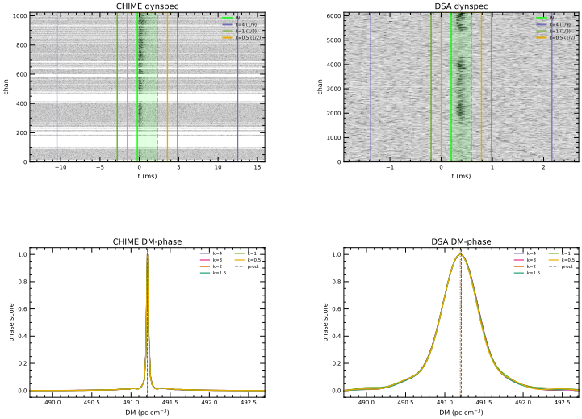

- **DSA DM → geo:** `491.1937` (ΔDM `-0.0133`)
- ToA meas `-2.375` ms · geo `-2.054` ms · resid `-0.321` ms
- CHIME envelope [-0.26, +2.29] ms ($W=2.55$ ms)
- DSA envelope [+0.20, +0.60] ms ($W=0.40$ ms)
- Source: `11h19m56.05s +70d40m34.4s`

### chromatica

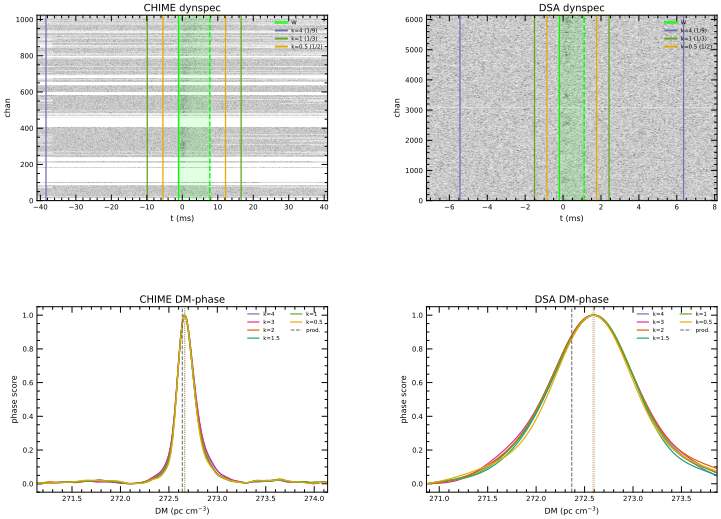

- **DSA DM → geo:** `272.5528` (ΔDM `-0.1112`)
- ToA meas `-4.971` ms · geo `-2.285` ms · resid `-2.686` ms
- CHIME envelope [-1.05, +7.77] ms ($W=8.82$ ms)
- DSA envelope [-0.20, +1.11] ms ($W=1.31$ ms)
- Source: `20h50m28.59s +73d54m00.0s`

### freya

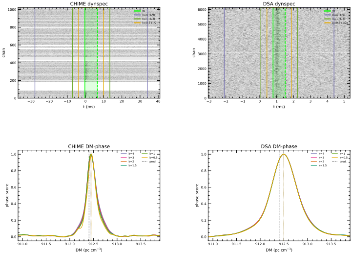

- **DSA DM → geo:** `912.5633` (ΔDM `+0.1633`)
- ToA meas `+1.649` ms · geo `-2.297` ms · resid `+3.946` ms
- CHIME envelope [-0.36, +6.51] ms ($W=6.87$ ms)
- DSA envelope [+0.79, +1.51] ms ($W=0.72$ ms)
- Source: `05h52m45.12s +74d12m01.7s`

### hamilton

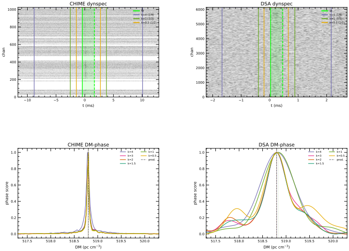

- **DSA DM → geo:** `518.8498` (ΔDM `+0.0508`)
- ToA meas `-0.849` ms · geo `-2.075` ms · resid `+1.226` ms
- CHIME envelope [-0.42, +1.68] ms ($W=2.10$ ms)
- DSA envelope [+0.03, +0.46] ms ($W=0.43$ ms)
- Source: `20h20m08.92s +70d47m33.96s`

### isha

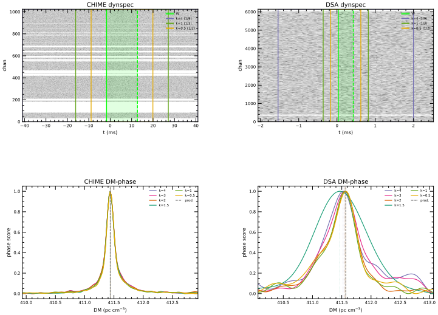

- **DSA DM → geo:** `411.5922` (ΔDM `+0.0242`)
- ToA meas `-1.450` ms · geo `-2.034` ms · resid `+0.584` ms
- CHIME envelope [-1.70, +12.72] ms ($W=14.42$ ms)
- DSA envelope [+0.03, +0.43] ms ($W=0.40$ ms)
- Source: `04h45m38.64s +70d18m26.6s`

### johndoeII

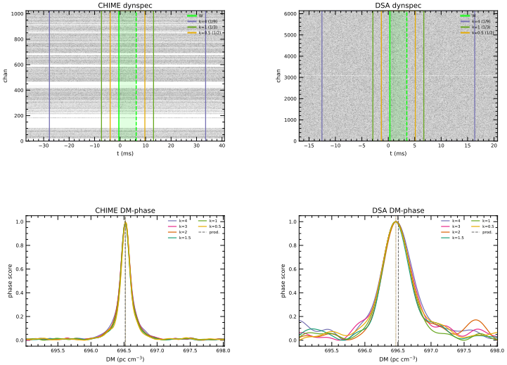

- **DSA DM → geo:** `696.6944` (ΔDM `+0.1884`)
- ToA meas `+2.330` ms · geo `-2.221` ms · resid `+4.551` ms
- CHIME envelope [-0.50, +6.31] ms ($W=6.81$ ms)
- DSA envelope [+0.30, +3.50] ms ($W=3.20$ ms)
- Source: `22h23m53.94s +73d01m33.26s`

### mahi

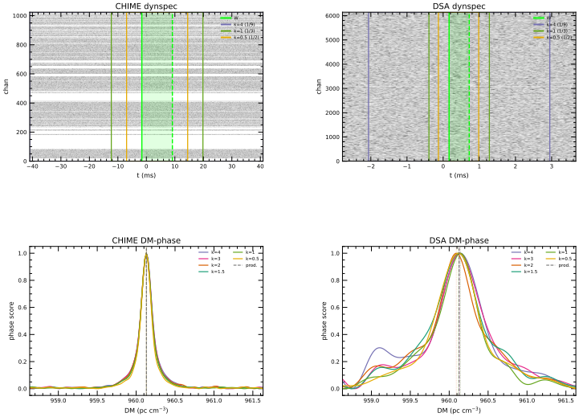

- **DSA DM → geo:** `960.0967` (ΔDM `-0.0313`)
- ToA meas `-2.841` ms · geo `-2.085` ms · resid `-0.756` ms
- CHIME envelope [-1.59, +9.13] ms ($W=10.72$ ms)
- DSA envelope [+0.16, +0.72] ms ($W=0.56$ ms)
- Source: `02h39m03.96s +71d01m04.3s`

### oran

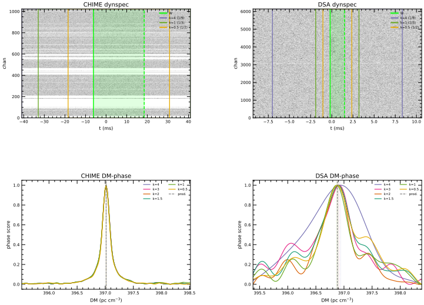

- **DSA DM → geo:** `397.2301` (ΔDM `+0.3481`)
- ToA meas `+6.194` ms · geo `-2.215` ms · resid `+8.408` ms
- CHIME envelope [-6.13, +18.50] ms ($W=24.63$ ms)
- DSA envelope [-0.20, +1.50] ms ($W=1.70$ ms)
- Source: `21h12m10.760s +72d49m38.20s`

### phineas

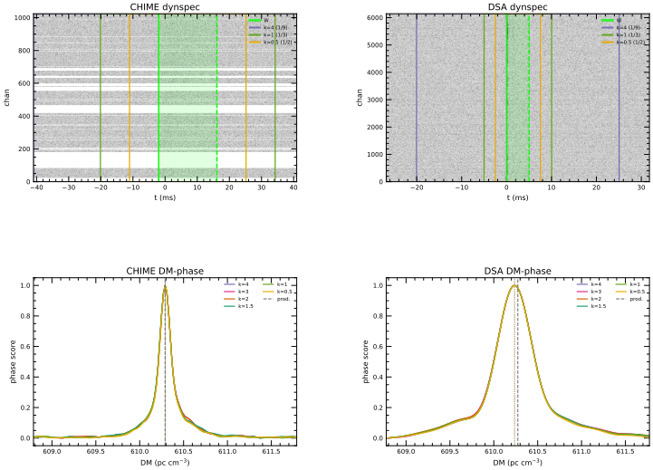

- **DSA DM → geo:** `610.4167` (ΔDM `+0.1427`)
- ToA meas `+1.319` ms · geo `-2.128` ms · resid `+3.448` ms
- CHIME envelope [-2.00, +16.13] ms ($W=18.13$ ms)
- DSA envelope [+0.00, +5.00] ms ($W=5.00$ ms)
- Source: `11h51m07.52s +71d41m44.3s`

### whitney

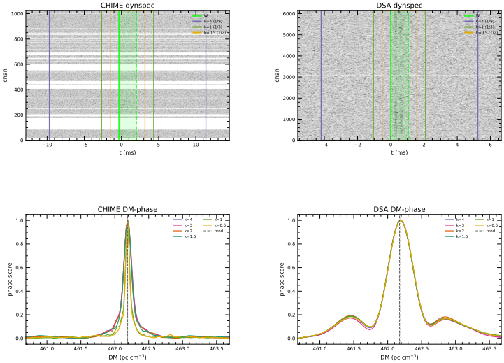

- **DSA DM → geo:** `462.2668` (ΔDM `+0.0928`)
- ToA meas `-0.002` ms · geo `-2.244` ms · resid `+2.242` ms
- CHIME envelope [-0.34, +2.00] ms ($W=2.34$ ms)
- DSA envelope [+0.00, +1.05] ms ($W=1.05$ ms)
- Source: `08h58m52.92s +73d29m27.0s`

### wilhelm

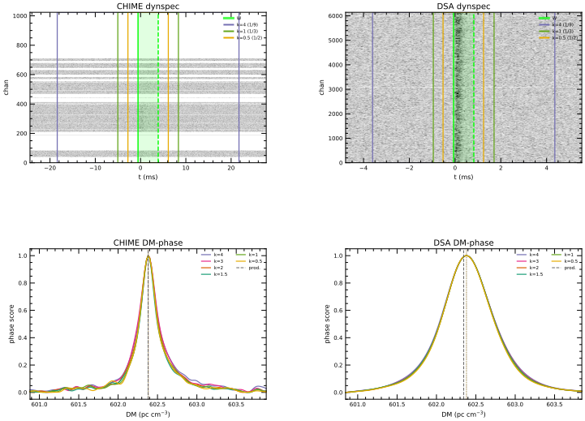

- **DSA DM → geo:** `602.6284` (ΔDM `+0.2824`)
- ToA meas `+4.670` ms · geo `-2.153` ms · resid `+6.823` ms
- CHIME envelope [-0.56, +3.90] ms ($W=4.46$ ms)
- DSA envelope [-0.07, +0.81] ms ($W=0.88$ ms)
- Source: `21h00m31.09s +72d02m15.22s`

### zach

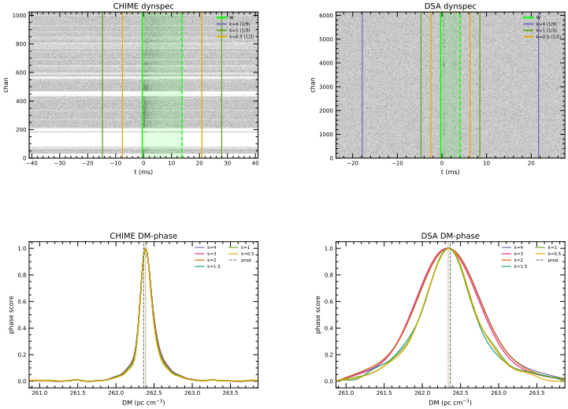

- **DSA DM → geo:** `262.4312` (ΔDM `+0.0632`)
- ToA meas `-0.686` ms · geo `-2.212` ms · resid `+1.526` ms
- CHIME envelope [-0.48, +13.73] ms ($W=14.21$ ms)
- DSA envelope [-0.29, +4.11] ms ($W=4.40$ ms)
- Source: `20h40m47.886s +72d52m56.378s`
