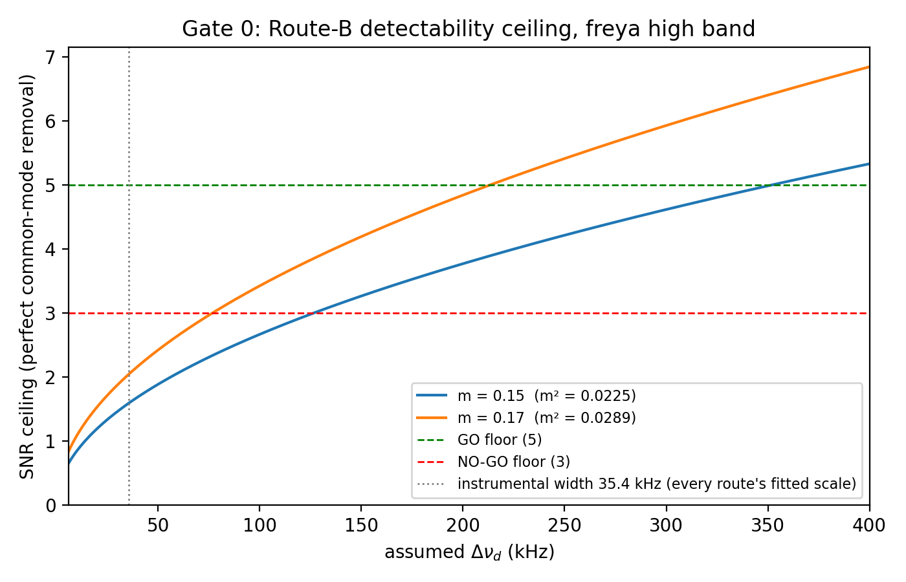

# Experiment Gate 0: is a CHIME Δν_d measurement detectable at the Route-B ceiling?

---
**Date:** 2026-07-15
**Author:** Claude (Fable 5), executing the owner-sanctioned Gate 0
(research-chime-scint-successor-routes.md, sanctioned in-session 2026-07-15)
**Status:** predeclared → executed same session; verdict in §Result
**Burst data touched:** none — all inputs are already-published summary
statistics from the common-mode research record
---

## Predeclaration (frozen before any number is computed)

**Question.** Route B's best case is *perfect* removal of the common-mode
instrumental response, leaving only radiometer/self-noise. At that ceiling, can
any estimator detect the freya scintillation Lorentzian on the retained-cadence
product? If the ceiling itself fails, no Route-B implementation can succeed and
the route is closed without building it.

**Model.** After perfect bandpass separation, the measurable is the burst-flux
spectrum over the high band. The optimal-quadratic-estimator (Fisher) bound for
the significance of a spectral-variance amplitude `m²` with scintle correlation
width `w` channels, against per-channel fractional noise `ε`, over `N_eff`
independent channels:

`SNR_ceiling = (m² / ε²) · sqrt(N_eff · w / 2)`   (valid for ε² ≫ m², which holds here)

with

- `ε² = f_b^{-2} · (1/(n_on·n_pol) + 1/(n_off·n_pol))` — per-channel
  noise-to-signal on the background-subtracted burst spectrum,
- `w = Δν_d / 6.1036 kHz`, swept over the prior range because Δν_d is unknown,
- `N_eff = 23064 / 2` — the ×2 oversampled channelization correlates adjacent
  fine channels, so only every second channel is independent.

**Pinned inputs** (all from `research-chime-scint-instrumental-common-mode.md`
direct measurements on the retained freya product):

| quantity | value | provenance |
|---|---|---|
| fine channels, high band | 23 064 @ 6.1036 kHz | measured product shape |
| time samples | 437 total; on-pulse 100 (250–350); off-pulse 337 usable | measured windows |
| polarizations averaged | 2 | product contract |
| burst flux fraction `f_b` | 0.05 (on/off mean = 1.05) | measured contrast |
| burst modulation `m` | 0.15–0.17 | prior route fits |
| Δν_d prior sweep | 6 kHz – 400 kHz | channel resolution → ×10 the 40 kHz scale every route fitted |

**Frozen verdict floor** (set now, before evaluation): with the ceiling
maximized over the Δν_d sweep at the favorable `m = 0.17`,

- `SNR_ceiling ≥ 5` → **GO** — build the Route-B estimator.
- `3 ≤ SNR_ceiling < 5` → **MARGINAL** — owner call with the curve in hand.
- `SNR_ceiling < 3` → **NO-GO** — Route B (and any estimator on this product
  cadence) is closed; the campaign conclusion is that the retained-cadence
  product is radiometer-limited for Δν_d even with the instrumental response
  perfectly removed.

**Deliverables.** `scripts/gate0_detectability.py` (stdlib + numpy +
matplotlib), the curve `gate0-detectability-curve.png`, and the §Result below.

## Result

**Verdict: GO** under the frozen floor — max ceiling over the sweep at
`m = 0.17` is **6.85** (≥ 5). `ε² = 2.59` per channel.

But the GO carries essential structure — the ceiling is monotonic in Δν_d, so
detectability is confined to the **large-Δν_d part of the prior**:

| threshold | m = 0.17 | m = 0.15 |
|---|---|---|
| SNR ≥ 3 (NO-GO floor) | Δν_d ≳ 77 kHz | Δν_d ≳ 127 kHz |
| SNR ≥ 5 (GO floor) | Δν_d ≳ 213 kHz | Δν_d ≳ 352 kHz |
| at 35 kHz (the instrumental scale) | 2.0 | 1.6 |

Interpretation for Route B:

1. **Build it** — the sanctioned route has a live detection window.
2. **The window must be predeclared in Route B's experiment record:** a
   detection claim is admissible only for fitted Δν_d inside the ≥3 region;
   a non-detection is reportable as the exclusion "no scintillation with
   Δν_d ≳ 77–127 kHz at m ≥ 0.15" — it cannot distinguish absence from
   Δν_d below the radiometer limit (a censored, not empty, result).
3. **If the two-screen expectation for the CHIME band sits below ~77 kHz, the
   likely scientific product of Route B is that upper-limit/censoring
   statement, not a measured Δν_d.** That is still a change from today: it
   would be radiometer-limited and quantified, not instrumental-systematics-
   limited and unquantified.

Reproduce: `python scripts/gate0_detectability.py` (conda `py312`; prints the
JSON verdict, writes the figure).
