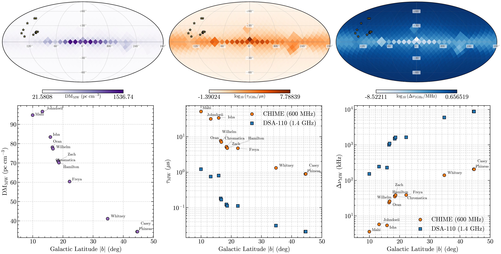

# NE2025 Milky Way Properties along Co-Detection Sightlines

---
**Date:** 2026-07-07  
**Author:** antigravity-gemini/session-2026-07-07  
**Data File:** [ne2025_mw_properties.csv](file:///Users/jakobfaber/Developer/repos/github.com/jakobtfaber/Faber2026/docs/rse/specs/ne2025_mw_properties.csv)  
**Telescope Band Centers:** CHIME = 600.19 MHz, DSA-110 = 1405.0 MHz  
**Trust Boundary:** `CONTEXT.md` (re-validation Phase V5 for DM budget)  
---

## Executive Summary

Milky Way interstellar medium (ISM) propagation properties were characterized along the 12 CHIME/FRB–DSA-110 co-detection sightlines using the NE2025 Galactic electron density model ([Ocker & Cordes 2026](https://ui.adsabs.harvard.edu/abs/2026ApJ...1002....3O)). We integrated the model to the Galactic edge ($d_{\text{max}} = 30\text{ kpc}$) in $d \rightarrow \text{DM}$ mode ($n_{\text{dir}} < 0$) to compute the total Galactic contributions. 

The predicted properties (dispersion, scattering, scintillation) show a strong latitude-dependent split. High-latitude sightlines ($|b| > 30^\circ$) present minimal MW contamination, with an expected MW dispersion floor of $\text{DM}_{\text{MW}} \lesssim 41\text{ pc cm}^{-3}$ and sub-microsecond scattering floors at CHIME bands. In contrast, low-latitude sightlines ($|b| < 15^\circ$) have substantial Galactic contributions, with $\text{DM}_{\text{MW}} \approx 95\text{ pc cm}^{-3}$ and a CHIME scattering floor of $\tau_{\text{MW}} \gtrsim 30\text{ }\mu\text{s}$, potentially masking extragalactic contributions.

## Visualization

*Figure: NE2025 Galactic electron density model predictions. Top row: All-sky Mollweide maps (in Galactic coordinates) showing predicted dispersion measure ($\text{DM}_{\text{MW}}$, left), pulse-broadening timescale ($\tau_{\text{MW}}$ at 1 GHz, middle), and scintillation bandwidth ($\Delta\nu_{\text{MW}}$ at 1 GHz, right). Yellow stars indicate the positions of the 12 sightlines. Bottom row: Individual sightline values plotted against absolute Galactic latitude $|b|$ for dispersion (left), scaled scattering timescale (middle; CHIME at 600 MHz in orange, DSA-110 at 1.4 GHz in blue), and scaled scintillation bandwidth (right). Scatter plots show values calculated assuming Kolmogorov scaling ($\alpha = 4.4$).*

## Characterization Table

The full output of the NE2025 model toward each sightline (including scaled scattering and scintillation properties at CHIME and DSA-110 band centers assuming Kolmogorov scaling, $\alpha = 4.4$) is presented below:

| Burst | $l$ ($^\circ$) | $b$ ($^\circ$) | $\text{DM}_{\text{MW}}$ ($\text{pc cm}^{-3}$) | $d_{\text{eff}}$ ($\text{kpc}$) | $\tau_{1\text{GHz}}$ ($\mu\text{s}$) | $\Delta\nu_{1\text{GHz}}$ ($\text{MHz}$) | $\tau_{\text{CHIME}}$ ($\mu\text{s}$) | $\Delta\nu_{\text{CHIME}}$ ($\text{kHz}$) | $\tau_{\text{DSA}}$ ($\mu\text{s}$) | $\Delta\nu_{\text{DSA}}$ ($\text{MHz}$) | $\nu_t$ ($\text{GHz}$) |
|---|---|---|---|---|---|---|---|---|---|---|---|
| **casey** | 133.33 | 44.56 | 34.46 | 1.09 | 0.095 | 1.95 | 0.89 | 206.58 | 0.021 | 8.72 | 7.77 |
| **chromatica** | 108.23 | 18.40 | 70.94 | 2.36 | 0.553 | 0.33 | 5.22 | 35.35 | 0.124 | 1.49 | 12.72 |
| **freya** | 139.46 | 22.17 | 60.39 | 1.69 | 0.502 | 0.37 | 4.74 | 38.91 | 0.112 | 1.64 | 12.47 |
| **hamilton** | 104.17 | 18.67 | 70.20 | 2.40 | 0.506 | 0.36 | 4.78 | 38.59 | 0.113 | 1.63 | 12.40 |
| **isha** | 140.32 | 15.83 | 83.44 | 1.91 | 3.598 | 0.051 | 34.01 | 5.43 | 0.806 | 0.23 | 22.07 |
| **johndoeii** | 112.56 | 13.20 | 96.64 | 2.57 | 3.366 | 0.055 | 31.81 | 5.80 | 0.754 | 0.24 | 21.48 |
| **mahi** | 131.53 | 9.96 | 94.78 | 2.22 | 5.421 | 0.034 | 51.24 | 3.60 | 1.214 | 0.15 | 24.83 |
| **oran** | 108.35 | 16.51 | 78.14 | 2.51 | 0.817 | 0.23 | 7.72 | 23.92 | 0.183 | 1.01 | 14.23 |
| **phineas** | 129.53 | 44.65 | 34.44 | 1.10 | 0.095 | 1.95 | 0.90 | 206.25 | 0.021 | 8.70 | 7.76 |
| **whitney** | 140.02 | 34.80 | 41.18 | 1.25 | 0.140 | 1.32 | 1.32 | 139.95 | 0.031 | 5.91 | 8.67 |
| **wilhelm** | 107.13 | 16.69 | 77.35 | 2.52 | 0.753 | 0.25 | 7.12 | 25.94 | 0.169 | 1.09 | 13.90 |
| **zach** | 106.94 | 18.39 | 71.00 | 2.38 | 0.542 | 0.34 | 5.13 | 36.01 | 0.121 | 1.52 | 12.65 |

*Note: All values scaled using $\alpha = 4.4$ from 1 GHz predictions. $\text{DM}_{\text{MW}}$ is integrated to 30 kpc. $\nu_t$ is the transition frequency between weak and strong scattering regimes.*

---

## Sightline Regimes & Key Physical Findings

### 1. High Galactic Latitude ($|b| > 30^\circ$)
*   **Sightlines:** `casey` ($44.6^\circ$), `phineas` ($44.7^\circ$), `whitney` ($34.8^\circ$).
*   **Dispersion:** $\text{DM}_{\text{MW}}$ is minimal ($34 - 41\text{ pc cm}^{-3}$), representing the clean Galactic halo limit.
*   **Effective Screen:** The scattering screen is located close to the Sun ($d_{\text{eff}} \approx 1.1 - 1.25\text{ kpc}$), dominated by local bubble structures or the transition to the thick disk.
*   **Scattering Floor:** Extremely low. The CHIME floor is $\tau_{\text{MW}} \lesssim 1.3\text{ }\mu\text{s}$, and the DSA-110 floor is $\approx 0.02-0.03\text{ }\mu\text{s}$ (effectively unbroadened for typical burst widths). Consequently, **any measured scattering exceeding $1.5\text{ }\mu\text{s}$ in this regime must have an extragalactic origin (host galaxy or intervening system).**
*   **Scintillation:** Scintles are broad ($\Delta\nu_{\text{DSA}} \approx 6 - 9\text{ MHz}$; $\Delta\nu_{\text{CHIME}} \approx 140 - 200\text{ kHz}$) and easily resolvable by both instruments.

### 2. Intermediate Galactic Latitude ($15^\circ < |b| < 30^\circ$)
*   **Sightlines:** `chromatica`, `freya`, `hamilton`, `oran`, `wilhelm`, `zach`.
*   **Dispersion:** Moderate Galactic contribution ($\text{DM}_{\text{MW}} \approx 60 - 78\text{ pc cm}^{-3}$).
*   **Effective Screen:** Located further out ($d_{\text{eff}} \approx 1.7 - 2.5\text{ kpc}$), indicating contribution from spiral arm crossings (e.g. Perseus).
*   **Scattering Floor:** The CHIME floor rises to $\tau_{\text{MW}} \approx 5 - 8\text{ }\mu\text{s}$, while the DSA floor remains low ($\approx 0.1 - 0.2\text{ }\mu\text{s}$). 
*   **Scintillation:** Scintillation bandwidths are moderate ($\Delta\nu_{\text{CHIME}} \approx 24 - 39\text{ kHz}$; $\Delta\nu_{\text{DSA}} \approx 1.0 - 1.6\text{ MHz}$).

### 3. Low Galactic Latitude ($|b| < 15^\circ$)
*   **Sightlines:** `isha` ($15.8^\circ$, behaves as low-latitude due to local spiral features), `johndoeii` ($13.2^\circ$), `mahi` ($10.0^\circ$).
*   **Dispersion:** Large Galactic contributions ($\text{DM}_{\text{MW}} \approx 83 - 97\text{ pc cm}^{-3}$), representing a major fraction of the total observed DM.
*   **Effective Screen:** Deeper screens ($d_{\text{eff}} \approx 1.9 - 2.6\text{ kpc}$) reflecting propagation through multiple spiral arm boundaries.
*   **Scattering Floor:** Very high. The CHIME floor is $\tau_{\text{MW}} \approx 30 - 51\text{ }\mu\text{s}$. The DSA floor rises to $\tau_{\text{MW}} \approx 0.8 - 1.2\text{ }\mu\text{s}$. In this regime, **Galactic scattering is significant and could easily be misattributed to the host galaxy if not carefully modeled.**
*   **Scintillation:** Scintillation bandwidth at CHIME is extremely narrow ($\Delta\nu_{\text{CHIME}} \approx 3.6 - 5.8\text{ kHz}$), falling below the native channel resolution of standard CHIME/FRB instruments. As a result, CHIME-band Galactic scintillation on these sightlines is quenched or unresolved.

---

## Implications for Re-Validation and the DM/Scattering Budget

1.  **Scattering Excess (V4/V5 Gate):** For low-latitude sightlines (`isha`, `johndoeii`, `mahi`), any observed scattering must be compared against the substantial MW floors ($\approx 30-50\text{ }\mu\text{s}$ at CHIME, $\approx 1\text{ }\mu\text{s}$ at DSA) to check if there is a statistically significant excess.
2.  **Scintillation Screen Identification (A1/A2 Gate):** Scintillation bandwidth $\Delta\nu_d$ measurements on these sightlines must match these predictions to confirm whether the dominant screen is indeed the Milky Way. For `freya` (intermediate-latitude), the measured CHIME $\Delta\nu_d = 35.2 \pm 4.4\text{ kHz}$ is highly consistent with the NE2025 predicted floor of $38.9\text{ kHz}$, confirming the Milky Way as the dominant screen.
