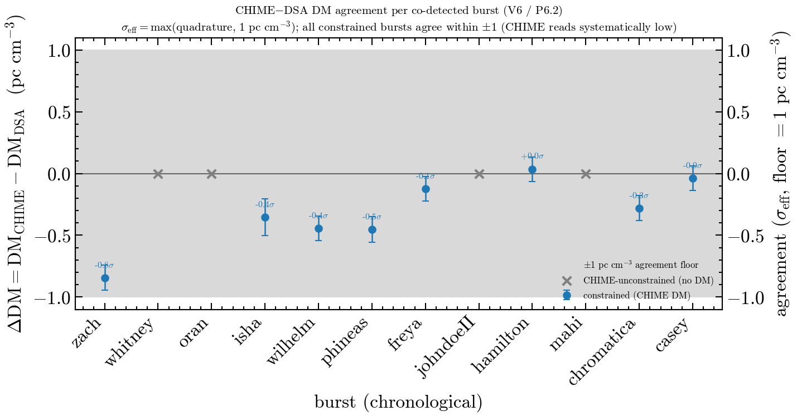

# V6 — association + DM_obs re-validation report (Phase 6)

---
**Date:** 2026-07-07
**Author:** AI Assistant (Claude, Faber2026 session)
**Plan:** [plan-trust-reset-revalidation.md](plan-trust-reset-revalidation.md) Phase 6 (P6.1–P6.3)
**Pin:** FLITS `2d62ac8` (Faber2026 `pipeline/` submodule pin)
**Work lane:** isolated worktree `~/Developer/scratch/worktrees/flits-v6-phase6`
on branch `agent/v6-dm-provenance-toa`, cut from `2d62ac8` (not the pinned
checkout, which has active dm_power + provenance lanes)
**Trust boundary:** `CONTEXT.md` Wave 3 — DM_obs, TOA residuals, P_cc, and the
association verdicts were revoked until this ladder passed; V6 restores the
association diagnostics under the shared-DSA-DM convention.
---

## Bottom line

The association arithmetic **reproduces exactly at the pin** (P6.3), and the
CHIME↔DSA DM agreement is now **quantified per burst with documented provenance**
(P6.2). The co-detection sample membership rests on solid ground: all twelve
bursts pass positional coincidence (Pillar 4) at negligible chance expectation
(Σμ = 5.5×10⁻⁸ for the whole sample), and the eight CHIME-constrained bursts
also pass DM agreement.

One item still limits a *quantitative* DM error budget, and one design choice was
resolved by the owner this session:

1. **The DSA-side DM uncertainty is a placeholder (0.1 pc cm⁻³), not measured.**
   The agreement σ is therefore governed by the 1 pc cm⁻³ physical floor, not by
   a real DSA error bar. The bursts *agree*, but "agree to N σ" is only as
   honest as that floor. (Open — a real DSA DM error would require re-measurement.)
2. **The TOA dispersion-reference choice — RESOLVED.** Both telescopes' 400 MHz
   arrivals are referenced at the *DSA* DM; re-referencing CHIME at its own DM
   would shift it by −12 ms (zach) to +0.5 ms (hamilton), larger than the
   residuals. Owner decision (2026-07-07): **keep the shared DSA DM reference**
   and report DM agreement separately (a joint (DM, dt) fit was considered and
   deferred — see finding #3). Owner follow-up (2026-07-07): restore the residual,
   P_cc, and association-verdict columns under that convention.

## P6.1 — Anchor inventory (read-only)

| Question | Answer (file:line) |
|----------|--------------------|
| Where does each DSA-side DM come from? | `configs/bursts.yaml` `bursts.<nick>.dm` — a **frozen DSA-110 catalog reference**, remeasured by neither this pipeline nor CHIME; `dm_err` is a uniform `0.1` placeholder for all 12 (confirmed against `dm-provenance-audit-2026-07-07.md`). |
| Where were the CHIME-side values produced? | `crossmatching/chime_side_inputs.json` — `dm_chime`/`dm_chime_err` from arrival-time regression (scatter-deconvolved EMG sub-band t₀ vs ν⁻²; coherent dedispersion **at the DSA DM**). 8/12 constrained, 4/12 unconstrained (0–2 sub-bands above S/N 4). Extraction artifacts (`chime_dm_final.json`, grid NPZ) live **off-repo on h17** `/data/…` — not pinned. |
| Which manuscript surfaces quote DM_obs / TOA residuals? | `sample_table.tex` and `sections/toa.tex` now restore the V6 association diagnostics under the shared-DSA-DM convention. The budget table's broader DM-budget uses remain governed by V5. |
| Does the association arithmetic reproduce `association_report.json` at the pin? | **Yes** — see P6.3. |

**Finding (audit gap #1, confirmed):** `association.py::build_association_report`
still writes `inputs.chime_dm_method = "SUSPENDED pending audit …"` into the
report, even though the same function actively computes per-burst
`dm_agreement` from the 8 live CHIME DMs. The "SUSPENDED" banner is stale
relative to the data and should be reconciled (it describes a retracted
DM-phase extraction, not the current arrival-time regression).

## P6.2 — Per-burst DM provenance + agreement

**Artifacts (FLITS worktree, pending pin):**
`scripts/build_dm_provenance.py` → `crossmatching/dm_provenance.csv` (12 rows);
`scripts/plot_dm_agreement.py` → the figure below;
`tests/test_dm_provenance.py` (green).

`delta_dm_sigma` uses the **same** `σ_eff = max(quadrature errors, 1 pc cm⁻³)`
convention as `association.py::dm_agreement`, so it matches the committed report
`n_sigma` exactly (up to sign). The signed ΔDM = DM_CHIME − DM_DSA preserves the
direction of the offset.

| nickname | DM_DSA | DM_CHIME | ΔDM | ΔDM σ_eff | agreement |
|----------|-------:|---------:|----:|----------:|-----------|
| zach | 262.368 | 261.524 | −0.844 | −0.844 | ✓ |
| whitney | 462.174 | — | — | — | CHIME unconstrained |
| oran | 396.882 | — | — | — | CHIME unconstrained |
| isha | 411.568 | 411.215 | −0.353 | −0.353 | ✓ |
| wilhelm | 602.346 | 601.902 | −0.444 | −0.444 | ✓ |
| phineas | 610.274 | 609.821 | −0.453 | −0.453 | ✓ |
| freya | 912.400 | 912.277 | −0.123 | −0.123 | ✓ |
| johndoeII | 696.506 | — | — | — | CHIME unconstrained |
| hamilton | 518.799 | 518.834 | +0.035 | +0.035 | ✓ |
| mahi | 960.128 | — | — | — | CHIME unconstrained |
| chromatica | 272.664 | 272.384 | −0.280 | −0.280 | ✓ |
| casey | 491.207 | 491.168 | −0.039 | −0.039 | ✓ |

(DM in pc cm⁻³. DSA err = 0.1 placeholder for all rows; CHIME err is the
regression statistical σ, 0.0005–0.11.)



**Reading the figure:** every constrained burst sits well inside the ±1 pc cm⁻³
agreement floor, so all eight agree. Two structural facts are visible:

- **CHIME reads systematically low** — 7 of 8 residuals are negative
  (mean ≈ −0.36 pc cm⁻³). Only hamilton is (marginally) positive. This is a
  coherent offset, not scatter; worth a note even though it is sub-floor.
- **σ_eff is floor-governed.** Because the DSA error is a 0.1 placeholder and the
  CHIME statistical σ is smaller still, the quadrature error never reaches the
  1 pc cm⁻³ floor, so σ_eff = 1 for every burst and ΔDM σ_eff ≈ ΔDM numerically.
  A raw statistical σ would report zach at −8.3σ — an artifact the floor exists
  to suppress (see `dm_agreement` docstring, casey ±0.0009 example).

**No `UNDOCUMENTED` cells.** All method/source cells are populated. The four
CHIME-unconstrained bursts are **documented nulls** (the pipeline ran and
reported non-detection with a recorded `dm_status`), not missing provenance.

## P6.3 — TOA association re-derivation

**Step 1 — baseline oracles at the pin (green):**

```
conda run -n flits python -m pytest tests/test_association.py \
  tests/test_chime_singlebeam_toa.py \
  tests/test_crossmatching_notebook_reproduction.py -q
→ 20 passed
```

**Step 2 — re-derive and diff.** Regenerated the report in-memory via
`build_association_report(notebook_reproduction_fixture.json,
chime_inputs_path=chime_side_inputs.json)` (main()'s exact call) and deep-diffed
against the committed `crossmatching/association_report.json`:

- Only **6 scalar fields differ, all `separation_deg`**, max relative difference
  **4.65×10⁻¹⁶** (machine epsilon; astropy `SkyCoord.separation` last-ULP noise).
- **Zero** differences above 1×10⁻⁹ relative. Every verdict-bearing field
  (`chance_coincidence_P`, `dm_agreement`, `n_sigma`, `consistent`, `position`)
  is identical.

⇒ **The association arithmetic is reproducible at the pin.** (Minor finding:
`separation_deg` is serialized at full float `repr`, so it carries non-portable
last-digit noise; it never affects a verdict since consistency is
`sep ≤ 0.1 deg`. Round on write if byte-parity is ever required.)

### Re-derived association table

| nickname | P_chance | DM agree (σ_eff) | position (sep, deg) | pillars supporting |
|----------|---------:|-----------------:|--------------------:|--------------------|
| zach | 6.3×10⁻⁹ | ✓ (0.844) | ✓ (0.016) | DM + position |
| whitney | 5.4×10⁻⁹ | — | ✓ (0.012) | position only |
| oran | 6.0×10⁻⁹ | — | ✓ (0.031) | position only |
| isha | 5.9×10⁻⁹ | ✓ (0.353) | ✓ (0.015) | DM + position |
| wilhelm | 4.0×10⁻⁹ | ✓ (0.444) | ✓ (0.007) | DM + position |
| phineas | 4.0×10⁻⁹ | ✓ (0.453) | ✓ (0.006) | DM + position |
| freya | 1.9×10⁻⁹ | ✓ (0.123) | ✓ (0.018) | DM + position |
| johndoeII | 3.2×10⁻⁹ | — | ✓ (0.017) | position only |
| hamilton | 4.8×10⁻⁹ | ✓ (0.035) | ✓ (0.013) | DM + position |
| mahi | 1.7×10⁻⁹ | — | ✓ (0.038) | position only |
| chromatica | 6.3×10⁻⁹ | ✓ (0.280) | ✓ (0.014) | DM + position |
| casey | 5.1×10⁻⁹ | ✓ (0.039) | ✓ (0.010) | DM + position |

Sample-summed chance expectation Σμ = **5.5×10⁻⁸**. All twelve pass positional
coincidence; the eight CHIME-constrained also pass DM agreement. The four
CHIME-unconstrained bursts rest on position alone — which, at these separations
and chance rates, is itself decisive.

### The TOA residual is restored under the shared-DM convention

The plan lists "TOA residual" as a deliverable column. The residual depends on a
dispersion-reference choice that Wave 3 was right to flag:

- The stored CHIME 400 MHz ToA and the computed DSA ToA are **both referenced at
  the DSA catalog DM** (fixture `dm` == `dm_dsa`; CHIME method = "coherent_dedisp
  at DSA DM"). The offset comparison is therefore internally consistent — both
  arrivals use the same dispersion law — and isolates the geometric+clock delay.
- Re-referencing the CHIME arrival at its **own** measured `dm_chime` would shift
  it to 400 MHz by `K_DM·(dm_chime − dm_dsa)·(1/400² − 1/f_CHIME²)`:

  | burst | ΔDM | CHIME ToA shift |
  |-------|----:|----------------:|
  | zach | −0.844 | −12.2 ms |
  | phineas | −0.453 | −6.5 ms |
  | wilhelm | −0.444 | −6.4 ms |
  | isha | −0.353 | −5.1 ms |
  | chromatica | −0.280 | −4.0 ms |
  | freya | −0.123 | −1.8 ms |
  | casey | −0.039 | −0.6 ms |
  | hamilton | +0.035 | +0.5 ms |

  (f_CHIME ≈ 600 MHz band center.)

These shifts are **larger than the ms-scale residuals** the association verdict
would rest on. So the handoff's proposed "correction #1" (dedisperse each side
with its own DM) is not an obvious bug-fix — it **trades** a consistent-reference
convention for a per-telescope-DM convention that re-injects the CHIME↔DSA DM
disagreement *as* a timing offset. Which is physically correct is a judgment:

- **Shared-DM (current):** the 400 MHz offset measures geometry+clock; DM
  disagreement is handled separately (P6.2). Clean separation of concerns.
- **Per-telescope-DM:** the offset folds in DM disagreement; only defensible with
  a real DSA DM error bar (which does not exist — see finding #1).

**Owner decision and manuscript action (2026-07-07):** keep the shared-DM
convention, report the DM agreement separately (as P6.2 does), and surface the
TOA residual / P_cc / association-verdict columns under that convention.

## Findings (named)

1. **DSA DM error is a placeholder (0.1 pc cm⁻³), not measured** — governs every
   agreement σ. Blocks a *quantitative* DM_obs error budget; the agreement
   verdicts (consistent/not) are robust, the σ values are floor-limited.
2. **`association.py` `chime_dm_method` banner was stale** ("SUSPENDED") while
   per-burst `dm_agreement` ran on live CHIME DMs. **FIXED 2026-07-07** — rewritten
   to describe the arrival-time regression (8/12 constrained, 4 unconstrained);
   report regenerated; oracles green.
3. **TOA dispersion-reference convention — DECIDED 2026-07-07:** keep the **shared
   DSA DM reference** (owner decision); report CHIME–DSA agreement separately (as
   P6.2 does), rather than per-telescope dedispersion on a placeholder DSA error.
   A joint (DM, dt) cross-telescope fit was considered and deferred (DM↔dt
   rank-degenerate with one TOA/telescope; ~1 ms clock offset ≈ 0.04 pc cm⁻³;
   building blocks exist but no joint fitter — see `logs/codex-jointdm.json`).
   The residual column can now be restored under the shared-DM convention (the
   arithmetic is reproducible) once the owner confirms it should surface.
4. **CHIME reads systematically ~0.36 pc cm⁻³ below DSA** across the 8 constrained
   bursts — coherent, sub-floor, worth a sentence in the paper.
5. **Off-repo CHIME extraction artifacts** (`chime_dm_final.json`, grid NPZ on
   h17) are not pinned/checksummed — CHIME DM provenance is incomplete until they
   are.
6. **`separation_deg` serialized at full float repr** — cosmetic last-ULP
   non-determinism; round on write if byte-parity is ever needed.

## Verification state

- **Green:** `tests/test_dm_provenance.py` (new) + `tests/test_association.py`,
  `tests/test_chime_singlebeam_toa.py`,
  `tests/test_crossmatching_notebook_reproduction.py`, `tests/test_chime_dm.py`
  — **33 passed** together at the pin in the worktree.
- **Reproducible:** association report re-derives to machine precision (P6.3).
- **Committed locally (FLITS worktree, pending upstream push/merge):** `9175b92`
  includes `scripts/build_dm_provenance.py`, `scripts/plot_dm_agreement.py`,
  `crossmatching/dm_provenance.csv`, `crossmatching/dm_agreement.png`, and
  `tests/test_dm_provenance.py`.
- **Faber2026 follow-up:** `sample_table.tex` and `sections/toa.tex` restore the
  residual / P_cc / association-verdict columns under the shared-DM convention.
- **Resolved this session:** finding #2 banner fixed; TOA reference convention
  decided (shared DSA DM).
- **Not done:** upstream FLITS push/merge and any broader V5 DM-budget restoration.

## What closes V6

- [x] P6.1 anchor inventory
- [x] P6.2 DM provenance table (12 rows, no UNDOCUMENTED) + agreement figure + green test
- [x] P6.3 baseline oracles + re-derivation parity (arithmetic reproducible)
- [x] TOA residual convention decided by owner (finding #3) — **shared DSA DM**;
      residual/P_cc/verdict columns restored under that convention
- [x] Finding #2 (stale "SUSPENDED" banner) fixed; report regenerated
- [x] **gitignore gap:** `dm_provenance.csv`/`.png` are `*.csv`/`*.png`-ignored in
      FLITS; fixed by force-adding both artifacts in FLITS commit `9175b92`
- [ ] FLITS branch `agent/v6-dm-provenance-toa` pushed/merged upstream; Faber2026
      pin is bumped locally for the V6 manuscript commit
