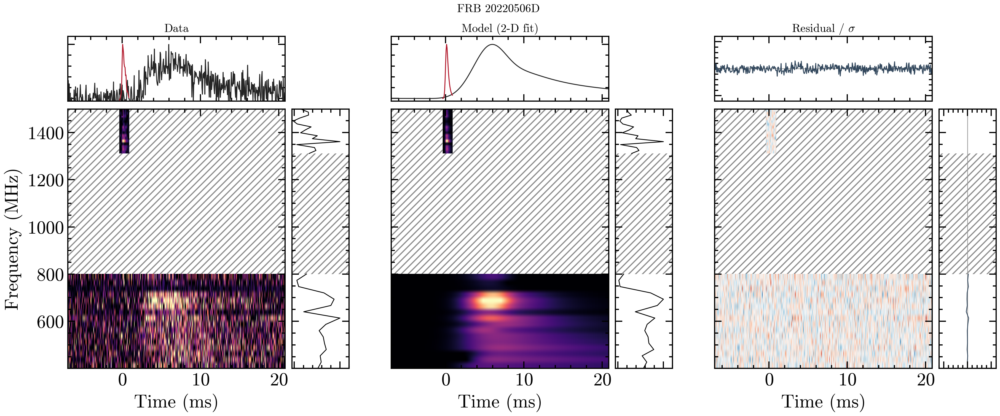
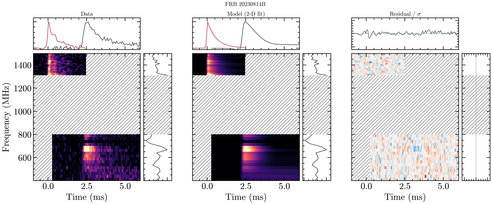
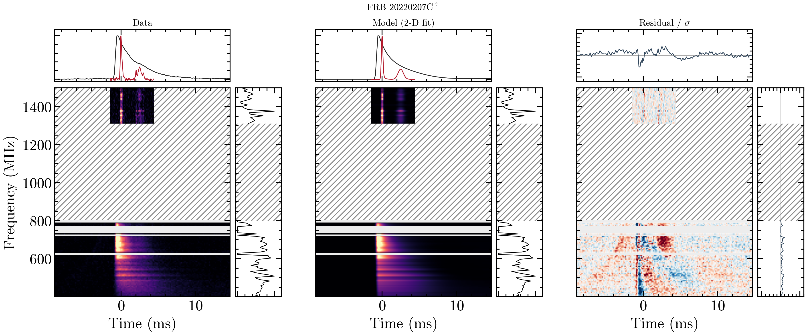

# Latest manuscript-bound triptychs

**Candidate figures · not yet inserted · component counts pending final ratification**

## oran · C1D1 · job 171

{ width="100%" }

## johndoeII · C1D2 · job 175

{ width="100%" }

## zach · C2D3 · job 178

{ width="100%" }
